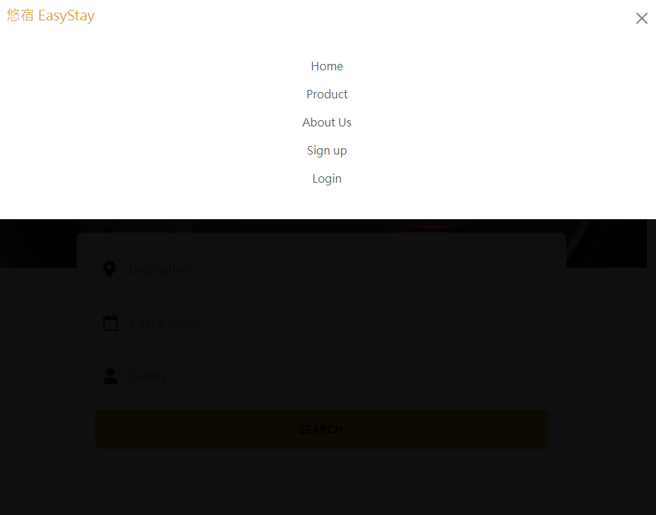
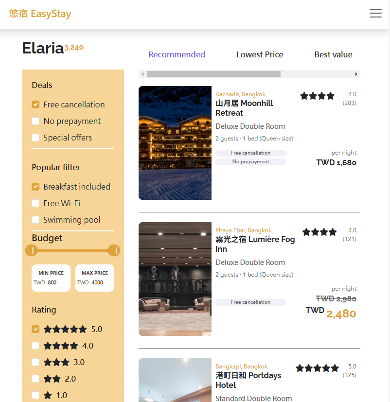

# 🏨 悠宿 EasyStay — 練習訂房平台切版專案

這是一個向知名住宿網站致敬的切版練習作品，模擬訂房平台的基本功能。使用者可瀏覽飯店資訊，也可註冊與登入帳號，體驗完整的使用流程。

我在此專案中負責整體前端切版與響應式設計，包含手機與桌面版的 UI 調整，並實作部分互動功能，如：
- 響應式漢堡選單切換
- 語言選擇下拉選單
- 滑桿顯示價格範圍ˊ
- 基本註冊與登入邏輯切換
- 手機版的飯店列表可以以價格做飯店排列順序

✅ 支援 **響應式網頁設計（RWD）**，可在桌機、平板、手機等裝置上自適應顯示。

## 專案畫面預覽
[住宿飯店網站](https://xiaojia0623.github.io/hotel-project/)
### 首頁畫面

 


### 飯店列表

  

### 飯店詳細頁面

 

---

## Node.js 版本
  - 專案的 Node.js 版本需為 v16 以上
  - 查看自己版本指令：`node -v`

---


## 🧰 使用技術與工具
| 類別 | 工具 / 技術 | 說明 |
|------|--------------|------|
| ⚙️ 構建工具 | [Vite](https://vitejs.dev/) | 快速且現代的前端建構工具，支援模組化與 HMR |
| 💅 樣式管理 | SCSS | 使用 SCSS 撰寫與管理樣式模組 |
| 📱 響應式設計 | RWD + [Bootstrap Grid](https://getbootstrap.com/docs/5.3/layout/grid/) | 支援多裝置瀏覽，自動排版調整 |
| 🎨 UI Framework | [Bootstrap 5](https://getbootstrap.com/) | 使用 Bootstrap 的 CSS + JS 元件 |
| 📦 套件管理 | npm | 管理專案依賴與指令腳本 |
| 🎯 動畫效果 | [AOS](https://michalsnik.github.io/aos/) | 元素滾動進場動畫套件 |
| 🎚️ 滑桿控制 | [noUiSlider](https://refreshless.com/nouislider/) | 自訂價格區間滑桿控制元件 |
| 🧰 DOM 操作 | [jQuery](https://jquery.com/)（選用） | 針對部分互動功能使用 jQuery 操作 DOM |
| 🧩 樣板引擎 | [EJS](https://ejs.co/) | HTML 模板組件拆分與重用（如 header、footer） |

---

## 資料夾結構
  - assets # 靜態資源放置處
    - images # 圖片放置處
    - scss # SCSS 的樣式放置處

  - layout # ejs 模板放置處
  - pages # 頁面放置處

- JavaScript 程式碼可寫在 main.js 檔案

---

## 開發模式的監聽
vite 專案執行開發模式 `npm run dev` 後即會自動監聽，不需要使用 `Live Sass Compiler` 的 `Watch SCSS` 功能


## 部署 gh-pages 流程說明
### Windows 版本
1. 在 GitHub 建立一個新的 Repository

2. 部署前請務必先將原始碼上傳到 GitHub Repository 也就是初始化 GitHub，因此通常第一步驟會在專案終端機輸入以下指令
```cmd
git init # 若已經初始化過就可以不用輸入
git add .
git commit -m 'first commit'
git branch -M main
git remote add origin [GitHub Repositories Url]
git push -u origin main // 僅限第一次輸入，往後只需要輸入 git push
```

3. 初始化完畢後，執行 `npm run deploy` 指令進行自動化部署
